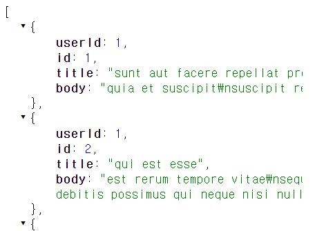
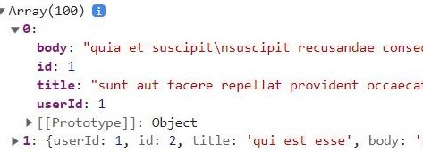

# Javascript
## callback 함수
[생활코딩님의 강의 영상](https://www.youtube.com/watch?v=TAyLeIj1hMc)을 참고하여 작성

### first class citizen (1급 객체 개념)
프로그래밍에는 1급 객체란 개념이 존재한다.

1. 변수의 값이 될 수 있는 객체는 1급 시민이다.
    - Javascript에서 숫자, 함수는 변수의 값이 될 수 있지만(=1급)
    - 조건문은 그렇지 않다.(=2급)
2. 함수가 다른 함수의 return 값이 될 수 있는 언어(JS)에서 함수는 1급 시민이다.
3. 함수가 다른 함수의 입력값이 될 수 있는 언어(JS)에서 함수는 1급 시민이다.

<br>

### callback이란?
```
val = function(A){
        return B
    }
function fn(arg){
    arg();
}
fn(val)
```
val은 바로 실행되진 않지만, 다른 함수의 입력값으로 전달 후, 다른 함수에 의해 나중에 호출된다 -> val은 callback function이다.

즉, <u>val 자체는 callback funtion이 아니지만</u>, **val이 다른 함수의 입력값으로 전달 되어 그것이 호출된다면** val은 이 맥락에서 콜백함수가 되는 것이다.

<br>

---

<br>

## Promise (callback & async)
[생활코딩님의 강의 영상](https://www.youtube.com/watch?v=TAyLeIj1hMc)을 참고하여 작성

동기 | 비동기
- 비동기는 각자 작업이 자신의 시간표대로 실행
- 동기 실행: 순차적으로 실행되믈, 어떻게 실행될 건지를 파악하기 쉽다.
- 비동기 실행: 말하자면 멀티태스킹, 굉장히 혼란스럽, 대신 훨씬 더 빠른 속도로 실행

언제 비동기적 처리를 하느냐
- 명령이 언제 끝날지 예측할 지 어렵거나
- 주가 되는 작업이 아닐 때
    - 대표: 통신(서버와 웹 브라우저 간) 끝날 때까지 다른 일 하고 있다가~~?
        -  브라우저와 웹 서버가 페이지 리로드 하지 않고도 자바스크립트 이용해서 서로 통신하는 것을 ajax라 한다.
        - 동기적으로 통신했다면, 서버와 웹 브라우저가 서로 통신할 동안 사용자는 아무 행위도 할 수 없었을 것. 

웹 브라우저와 웹 서버가 통신할 때 사용하는 Fetch API(Promise를 사용함)

### Using Fetch - MDN web docs
```
<script>
    fetch('http://example.com/movies.json')
        .then((response) => response.json())
        .then((data) => console.log(data));
</script>
```
- data라는 매개변수를 통해, 웹서버가 리턴해 준 json 데이터 타입을 자바스크립트의 데이터 타입에 맞게 컨버팅한 결과를 가져올 수 있게 된다라는 취지의 코드이다.
- 여기서 then이 바로 Promise이다.

<p align="center">
    
</p> 
<p align="center">
    
</p> 

```
<script>
    console.log(1);
    fetch('https://jsonplaceholder.typicode.com/posts')
        .then((response) => response.json())
        .then((data) => console.log(data));
    console.log(2);
    // 1, 2가 먼저 출력되는 동안 fetch가 json 데이터를 자바스크립트 형식의 데이터로 바꾸는 작업이 실행된다.
    // 1, 2, 데이터 순으로 출력된다.
</script>
```


[참고] [json placeholder 사이트](https://jsonplaceholder.typicode.com/) 이용
- 프로토타입으로 웹사이트 만들 때, 쉽게 서버를 마련할 수 있다.
- [/posts 링크](https://jsonplaceholder.typicode.com/posts) 클릭 -> 각각의 글들을 json이라는 데이터 타입으로 만들어서 응답해주는 url