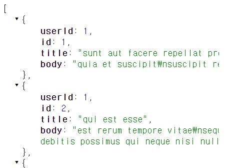
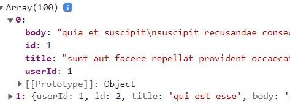

# Javascript
## Promise (callback & async)
[생활코딩님의 강의 영상](https://www.youtube.com/watch?v=TAyLeIj1hMc)을 참고하여 작성

동기 | 비동기
- 비동기는 각자 작업이 자신의 시간표대로 실행
- 동기 실행: 순차적으로 실행되믈, 어떻게 실행될 건지를 파악하기 쉽다.
- 비동기 실행: 말하자면 멀티태스킹, 굉장히 혼란스럽, 대신 훨씬 더 빠른 속도로 실행

언제 비동기적 처리를 하느냐
- 명령이 언제 끝날지 예측할 지 어렵거나
- 주가 되는 작업이 아닐 때
    - 대표: 통신(서버와 웹 브라우저 간) 끝날 때까지 다른 일 하고 있다가~~?
        -  브라우저와 웹 서버가 페이지 리로드 하지 않고도 자바스크립트 이용해서 서로 통신하는 것을 ajax라 한다.
        - 동기적으로 통신했다면, 서버와 웹 브라우저가 서로 통신할 동안 사용자는 아무 행위도 할 수 없었을 것. 

웹 브라우저와 웹 서버가 통신할 때 사용하는 Fetch API(Promise를 사용함)

### [Using Fetch - MDN web docs](https://developer.mozilla.org/en-US/docs/Web/API/Fetch_API/Using_Fetch)
```
<script>
    fetch('http://example.com/movies.json')
        .then((response) => response.json())
        .then((data) => console.log(data));
</script>
```
- data라는 매개변수를 통해, 웹서버가 리턴해 준 json 데이터 타입을 자바스크립트의 데이터 타입에 맞게 컨버팅한 결과를 가져올 수 있게 된다라는 취지의 코드이다.
- 여기서 then이 바로 Promise이다.

<p align="center">
    
</p> 
<p align="center">
    
</p> 

```
<script>
    console.log(1);
    fetch('https://jsonplaceholder.typicode.com/posts')
        .then((response) => response.json())
        .then((data) => console.log(data));
    console.log(2);
    // 1, 2가 먼저 출력되는 동안 fetch가 json 데이터를 자바스크립트 형식의 데이터로 바꾸는 작업이 실행된다.
    // 1, 2, 데이터 순으로 출력된다.
</script>
```

> [A Promise that resolves to a Response object.](https://developer.mozilla.org/en-US/docs/Web/API/fetch#return_value)
- [fetch()](https://developer.mozilla.org/en-US/docs/Web/API/fetch)는 Promise라는 데이터 타입을 리턴하는데, 그 Promise는 Response object를 돌려줄 것이다.
- 여기서 resolve란, 성공적으로 실행되었단 의미이다.
- 즉 **fetch()가 성공적으로 실행**된다면 **Response object**를 돌려줄 **Promise 데이터 타입**을 fetch()가 리턴할 것이다.  

<br>

1. 함수의 리턴값이 promise이다 -> 이 함수는 비동기적으로 동작하는 함수일 가능성이 매우 높다.
2. 그 함수가 리턴한 값은 두 개의 함수(정확히는 메소드)를 사용할 수 있다.
    - 그 메소드는 then, catch. 둘 다 콜백 함수를 받고, 파라미터(then은 result를 알려주는 거고, catch는 reason이라고 해보자)를 하나씩 가진다.
    - then은 fetch를 통해 실행한 결과가 성공했을 때 then으로 전달된 콜백 함수가 호출되도록 약속되어 있다. callback 함수가 호출되면서

<br>

```
<script>
    let fetched = fetch('https://jsonplaceholder.typicode.com/posts');
    console.log('fetched', fetched);
    // fetch()는 Promise라는 데이터 타입을 리턴한다.

    // fetch()를 통해 실행한 결과가 성공했을 때 then으로 전달된 callback 함수가 호출되도록 약속되어 있다.
    // 해당 callback함수가 호출된 결과값이 있다면 첫번쨰 파라미터(result)로 받을 수 있다.
    fetched.then(result => {
        console.log('result', result);
    });
    // Promise를 리턴하는 함수(fetch) 실행 결과 실패했다면, catch() 안으로 전달된 callback 함수가 호출된다. 파라미터 reason에 이유가 담겨 있다.
    fetched.catch(reason => {
        console.log('reason', reason);
    });
</script>
```

[이용할 사이트]  
[json placeholder 사이트](https://jsonplaceholder.typicode.com/) 이용
- 프로토타입으로 웹사이트 만들 때, 쉽게 서버를 마련할 수 있다.
- [/posts 링크](https://jsonplaceholder.typicode.com/posts) 클릭 -> 각각의 글들을 json이라는 데이터 타입으로 만들어서 응답해주는 url

[MDN - Promise](https://developer.mozilla.org/en-US/docs/Web/JavaScript/Reference/Global_Objects/Promise)
