# Part 1: Gatsby 사이트 생성 및 배포

> 이 글은 **Gatsbyjs**의 "[Part 1: Create and Deploy Your First Gatsby Site](https://www.gatsbyjs.com/docs/tutorial/part-1/)"을 번역한 후 수정한 것입니다. 원본 문서는 [MIT 라이선스](https://opensource.org/licenses/MIT)에 따라 사용할 수 있습니다.

<details><summary>목차</summary>
<p>

[Gatsby 사이트 생성](#gatsby-사이트-생성)

[로컬에서 사이트 실행](#로컬에서-사이트-실행)

[사이트에 대한 GitHub 리포지토리 설정](#사이트에-대한-github-리포지토리-설정)

[Gatsby Cloud로 사이트 구축](#gatsby-cloud로-사이트-구축)

[요약](#요약)

- [핵심 내용](#핵심-내용)
- [다음에 배울 내용](#다음에-배울-내용)

</p>
</details>

## 소개

필요한 모든 도구로 컴퓨터 설정을 완료했으니, 이제 시작할 시간입니다.

튜토리얼 강좌를 통해 Gatsby Site를 구축 및 배포하게 될 것입니다. 이는 이미지와 MDX를 지원하는 블로그 사이트입니다.

- [완성된 사이트 예시](https://gatsbytutorialexample.gatsbyjs.io/)
- [완성된 예시의 GitHub 리포지토리](https://github.com/gatsbyjs/tutorial-example)

이번 장에서는 블로그 사이트 템플릿을 생성하고 이를 모든 사람들이 볼 수 있도록 온라인에 배포하는 과정을 거칠 것입니다.

아래 다이어그램은 이 과정이 어떻게 어우러지는 지를 개략적으로 보여줍니다.
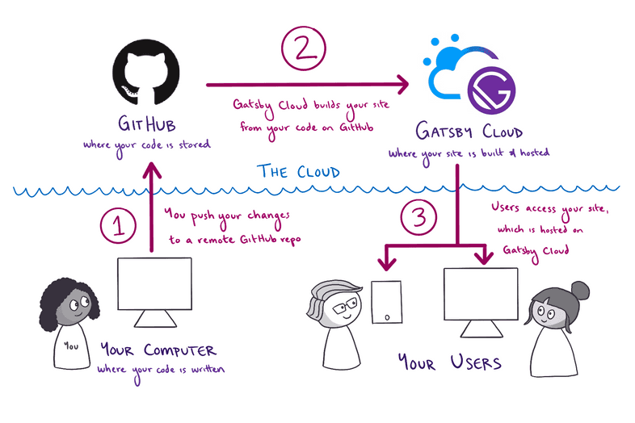  
_Image by Gatsbyjs, from https://www.gatsbyjs.com/docs/tutorial/part-1/, licensed under [MIT](https://opensource.org/licenses/MIT)._

<details><summary>자세한 설명</summary>
<p>

먼저, 컴퓨터에서 Gatsby 사이트를 구성하는 코드를 작성합니다. 변경 사항을 인터넷 상에 적용할 준비가 되면 다음 단계를 거칩니다.

1. 컴퓨터에서 변경한 사항을 GitHub 원격 저장소로 푸시합니다. GitHub은 프로젝트의 코드를 저장하는 온라인 플랫폼입니다.
2. Gatsby Cloud는 GitHub 저장소의 변경 사항을 확인합니다. Gatsby Cloud가 새로운 변화를 감지하면 GitHub의 코드로부터 사이트를 구축합니다.
3. Gatsby Cloud는 사이트의 완성 버전을 고유한 URL에서 호스팅하며, 사용자는 이를 통해 사이트의 최신 버전에 접근할 수 있습니다.

</p>
</details>

## Gatsby 사이트 생성

Gatsby 사이트를 생성하기 위해, Gatsby 커맨드 라인 인터페이스 (CLI)의 명령 `gatsby new`를 사용합니다. 해당 명령어는 구축할 사이트에 관해 묻는 대화형 프롬프트를 화면에 띄웁니다. 모든 정보를 입력하면, CLI는 이에 맞는 새 Gatsby 사이트를 자동으로 생성합니다.

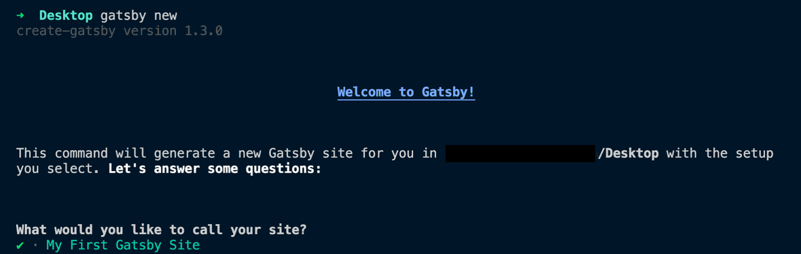  
_Image by Gatsbyjs, from https://www.gatsbyjs.com/docs/tutorial/part-1/, licensed under [MIT](https://opensource.org/licenses/MIT)._

> **Note:** 이 튜토리얼을 따르려면 Gatsby CLI가 v4.8 이상이어야 합니다. 설치한 버전을 확인하려면 다음의 명령을 실행하십시오.

```shell
gatsby --version
```

> Gatsby CLI 최신 버전을 사용하려면 아래 명령을 실행하십시오.

```shell
npm install -g gatsby-cli
```

과정을 자세히 살펴봅시다.

1. 커맨드 라인을 열고, `cd` 명령을 사용하여 새 Gatsby 사이트를 생성하고 싶은 폴더로 디렉토리를 변경합니다. 예를 들어, 새로운 사이트를 desktop에 생성하고 싶다면 다음과 같이 입력하면 됩니다.

```shell
cd Desktop
```

2. 커맨드 라인에서 다음의 명령을 실행합니다. 이로써 새 Gatsby 사이트 생성에 도움을 주는 대화형 프롬프트가 시작됩니다.

```shell
gatsby new
```

> **`gatsby new` 실행에 문제가 있습니까?** Part 0에서 `gatsby-cli`를 전역으로 설치할 때 문제가 있었다면, `gatsby new` 대신 `npm init gatsby`를 실행하여 새로운 사이트를 생성할 수 있습니다.

3. 프롬프트에서 <b>"What would you like to call your site?"</b>라고 물으면 사이트 이름을 입력합니다.

```shell
What would you like to call your site?
✔ · My First Gatsby Site
```

4. 프롬프트에서 **“What would you like to name the folder where your site will be created?”**라고 물으면, 선택했던 사이트 이름에 기반한 디폴드 폴더 이름을 입력합니다.

```shell
What would you like to name the folder where your site will be created?
✔ Desktop/ my-first-gatsby-site
```

5. 프롬프트에서 **"Will you be using JavaScript or TypeScript?"**라고 물으면 **Javascript**를 선택합니다.

```shell
Will you be using JavaScript or TypeScript?
❯ JavaScript
  TypeScript
```

> 이 튜토리얼에서는 TypeScript에 관한 어떠한 사전 지식도 필요하지 않습니다. TypeScript에 익숙하다면 [Gatsby and TypeScript guide](https://www.gatsbyjs.com/docs/how-to/custom-configuration/typescript/)를 읽어 타이핑, 파일, 규칙에 대해 배울 수 있습니다. TypeScript를 사용하고 싶다면, 먼저 튜토리얼을 거치고 나서야 프로젝트를 TypeScript로 변환하기를 권합니다.

6. 프롬프트에서 **"Will you be using a CMS?"**라고 물으면 **"No (or I'll add it later)"**를 선택합니다. (나중에 수동으로 추가할 것입니다.)

```shell
✔ Would you like to install a styling system?
· No (or I'll add it later)
```

> 앞으로, 이러한 옵션을 사용해서 사이트에 추가하고 싶은 기능을 `gatsby new`에 알릴 수 있습니다. 그러면 `gatsby new`는 자동으로 해당 옵션을 구성해 줄 것입니다. 이는 새 프로젝트의 옵션을 설정하는 훨씬 빠른 방법입니다.
>
> 하지만 이 첫 번째 사이트에서는 Gatsby의 조각이 어떻게 조합을 이루는 지를 배우기 위해 수동으로 설정할 것입니다.

7. 프롬프트에서 **“Would you like to install a styling system?”**라고 물으면 **“No (or I’ll add it later)”**를 선택합니다. (나중에 수동으로 추가할 것입니다.)

```shell
✔ Would you like to install a styling system?
· No (or I'll add it later)
```

8. 프롬프트에서 **“Would you like to install additional features with other plugins?”**라고 물으면 방향키와 엔터키를 사용해서 **"Done"**을 선택합니다.

```shell
✔ Would you like to install additional features with other plugins?
· Done
```

9. 프롬프트는 `gatsby new`가 할 작업을 요약해서 아래 출력처럼 보여줄 것입니다.

```shell
Thanks! Here's what we'll now do:

    🛠  Create a new Gatsby site in the folder my-first-gatsby-site


? Shall we do this? (Y/n) › Yes
```

10. 프롬프트에서 **"Shall we do this?"**라고 물으면 **"Y"**를 입력합니다. 그러면 `gatsby new` 명령은 사이트를 구축하기 시작합니다. 이 때 인터넷 다운로드 속도가 해당 명령이 실행되는데 걸리는 시간에 영향을 미칩니다. 작업이 끝나면, 다음과 같은 메시지가 보일 것입니다.

```shell
🎉  Your new Gatsby site My First Gatsby Site has been successfully
created at ~/Desktop/my-first-gatsby-site.
Start by going to the directory with

  cd my-first-gatsby-site

Start the local development server with

  npm run develop

See all commands at

  https://www.gatsbyjs.com/docs/gatsby-cli/
```

<br>

## 로컬에서 사이트 실행

지금까지 사이트를 구성하는 코드를 만들었는데, Firefox나 Google Chrome과 같은 웹 브라우저에서 실제로 보이는 모습은 어떠할까요? 이를 알고 싶다면, 먼저 사이트의 로컬 개발 서버를 작동시커야 합니다.

**개발 서버**는 로컬 환경에서 (개인 컴퓨터에서) 사이트에 대한 작업을할 때 유용한 도구입니다. 개발 서버가 실행되는 동안, 웹 브라우저를 사용하여 사이트의 로컬 복사본과 상호작용할 수 있습니다. 이런 식으로 사이트의 새 버전을 인터넷에 실제로 발행하기 전에, 코드 변경 사항을 검사하여 제대로 작동하는지 확인할 수 있습니다.

개발 서버를 작동시키려면 다음을 실행합니다.

1. 커맨드 라인에서 사이트용으로 만든 디렉토리로 변경합니다.

```shell
cd my-first-gatsby-site
```

> **Tip:** 사이트에 대해 어떤 명령이든 실행하려면, 항상 해당 사이트용 컨텍스트에 있어야 합니다. 즉, 커맨드 라인이 사이트의 코드가 있는 디렉토리를 가리켜야 합니다.

<br>

2. 사이트 디렉토리에서 다음 명령을 실행하여 개발 서버를 작동시킵니다.

```shell
gatsby develop
```

> Gatsby 커맨드 라인 인터페이스(CLI)를 전역으로 설치할 수 없다면, 다음 명령을 대신 사용해서 개발 서버를 작동시킬 수 있습니다.

```shell
npm run develop
```

<br>

3. 잠시 후, 커맨드 라인은 다음과 같은 메시지를 출력하여 개벌 서버가 시작할 준비가 되었음을 알려줄 것입니다.

```shell
You can now view my-first-gatsby-site in the browser.
⠀
  http://localhost:8000/
⠀
View GraphiQL, an in-browser IDE, to explore your site's data and
schema
⠀
  http://localhost:8000/___graphql
```

<br>

4. 가장 선호하는 웹 브라우저를 열어 `http://localhost:8000`으로 이동합니다.

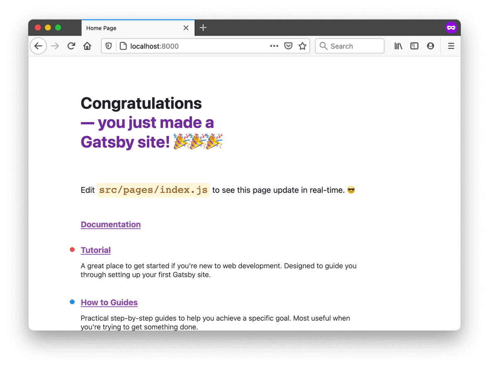
_Image by Gatsbyjs, from https://www.gatsbyjs.com/docs/tutorial/part-1/, licensed under [MIT](https://opensource.org/licenses/MIT)._

<br>

첫 번째 Gatsby 사이트가 바로 여기에 있습니다! 🎉

개발 서버가 실행 중인 한, 로컬에서 `http://localhost:8000/` 사이트를 언제든 방문할 수 있습니다. 개발 서버 실행을 중단하려면 터미널 윈도우로 돌아가가 `ctrl-c`를 누릅니다. 재시작하려면 `gatsby develop`을 다시 실행합니다!

> **Note:** vargant와 같은 VM 설정을 사용 중이거나 로컬 IP 주소에서 수신을 대기하려 한다면, `gatsby develop --host=0.0.0.0`을 실행합니다. 이제 개발 서버는 `http://localhost`와 여러분의 로컬 IP 모두에서 수신을 대기할 수 있습니다.

<br>

## 사이트에 대한 GitHub 리포지토리 설정

GitHub은 많은 개발자들이 온라인에 코드를 백업, 공유하기 위해 사용하는 웹사이트입니다. 코드를 GitHub에 업로드하면, 다른 컴퓨터를 사용하더라도 동일한 코드베이스 에서 작업할 수 있습니다. 또한 Gatsby Cloud를 사용하여 사이트를 구축하고 호스팅할 수 있습니다.

1. GitHub의 각 코드베이스는 고유한 **저장소**(원어를 축약해서 "repo"라 칭하기도 합니다.)에 저장됩니다. 블로그용으로 새로운 저장소를 생성하려면 네비게이션 바 우측 상단에 보이는 더하기 아이콘을 클릭합니다. 그리고 "New repository"를 선택합니다.

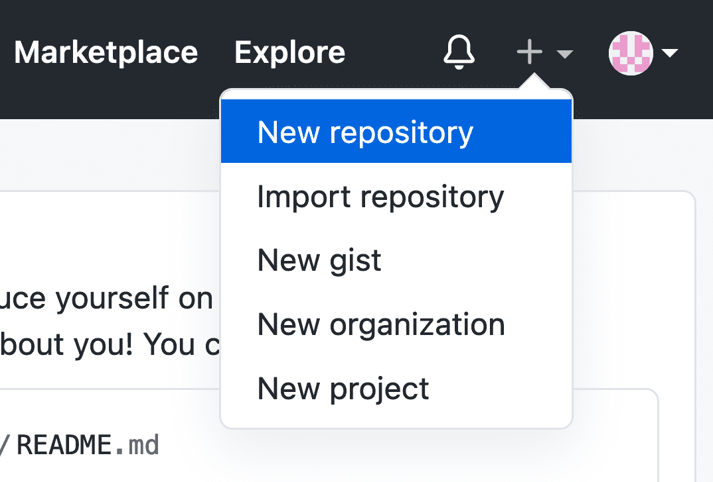
_Image by Gatsbyjs, from https://www.gatsbyjs.com/docs/tutorial/part-1/, licensed under [MIT](https://opensource.org/licenses/MIT)._

<br>

2. 새 리포 양식을 작성할 때, 이를 public 또는 private으로 설정할 수 있습니다. (이는 GitHub에 저장된 코드의 가시성에만 영향을 미칩니다. 여러분의 사이트가 Gatsby Cloud를 통해 한 번 배포된 이후에는, 누구든 사이트를 볼 수 있습니다.) 초기화 옵션의 체크박스는 선택하지 않은 채로 둡니다.

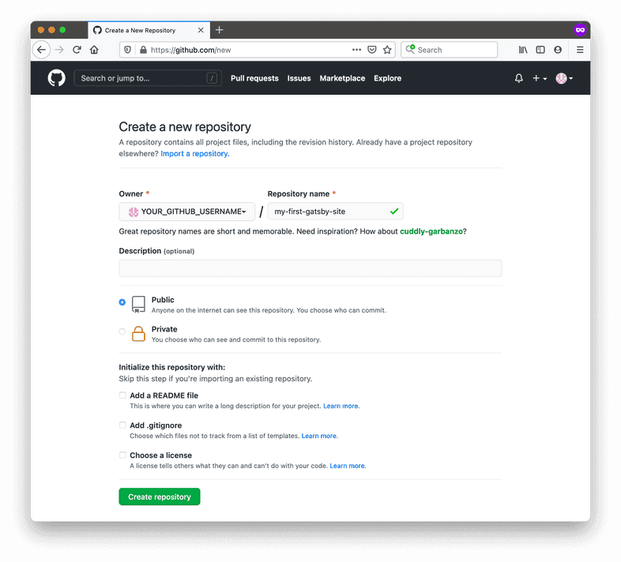
_Image by Gatsbyjs, from https://www.gatsbyjs.com/docs/tutorial/part-1/, licensed under [MIT](https://opensource.org/licenses/MIT)._

<br>

3. 컴퓨터에 존재하는 코드를 새로운 GitHub 저장소에 푸시하려면, 커맨드 라인에 아래의 명령을 입력합니다. `YOUR_GITHUB_USERNAME`과 `YOUR_GITHUB_REPO_NAME`을 실제로 GitHub에서 사용하고 있는 이름으로 반드시 교체하십시오.

```shell
git remote add origin https://github.com/YOUR_GITHUB_USERNAME/YOUR_GITHUB_REPO_NAME.git
git branch -M main
git push -u origin main
```

<br>

> **GitHub을 처음 사용하십니까?**
>
> 처음으로 GitHub에 코드를 푸시할 때 권한 관련 오류를 마주했다면, GitHub 계정에 대한 **personal access token**을 설정해야 합니다. 이를 통해 GitHub은, 코드 변경 사항을 원격 저장소에 푸시할 권한을 여러분의 컴퓨터가 가지고 있음을 인지합니다.
>
> personal access token을 설정하는 방법은 GitHub이 제공하는 안내서 [Creating a personal access token](https://docs.github.com/en/authentication/keeping-your-account-and-data-secure/creating-a-personal-access-token)에서 확인하십시오. 변경 사항을 저장소에 푸시하려면 personal access token가 **리포** 스코프를 가져야 합니다.

<br>

이제 여러분의 코드 복사본을 GitHub 서버에 저장했습니다. 다음 단계에서는 Gatsby Cloud 계정을 방금 생성한 GitHub 리포에 연결할 것입니다.

<br>

## Gatsby Cloud로 사이트 구축

Gatsby Cloud는 Gatsby 사이트를 구축, 배포, 호스팅 하는 작업에 특별히 최적화된 인프라 플랫폼입니다. 한 번 Gatsby Cloud 계정을 GitHub 저장소에 연결하면 Gatsby Cloud가 여러분의 사이트를 구축하여, 다른 사람들이 인터넷에서 해당 사이트를 볼 수 있습니다.

GitHub에 저장된 코드를 Gatsby Cloud 계정에 연결하려면 다음을 실행하십시오.

1. [Gatsby Cloud Dashboard](https://www.gatsbyjs.com/dashboard/)로 이동합니다. **"Add a site"** 버튼을 클릭합니다.

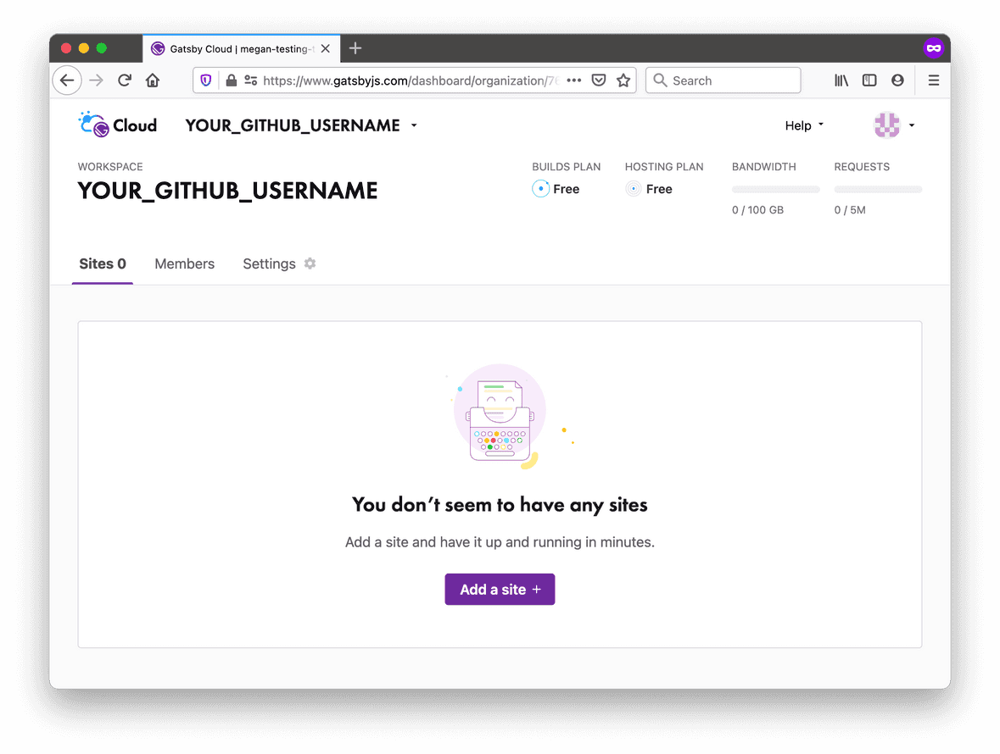
_Image by Gatsbyjs, from https://www.gatsbyjs.com/docs/tutorial/part-1/, licensed under [MIT](https://opensource.org/licenses/MIT)._

<br>

2. 다음 몇 단계를 통해 여러분의 사이트를 Gatsby Cloud에 추가할 수 있습니다. 먼저, Git 제공자로 GitHub을 선택하기 위해 **"Import from a Git repository"** 카드에서 **"GitHub"** 아이콘을 클릭합니다.

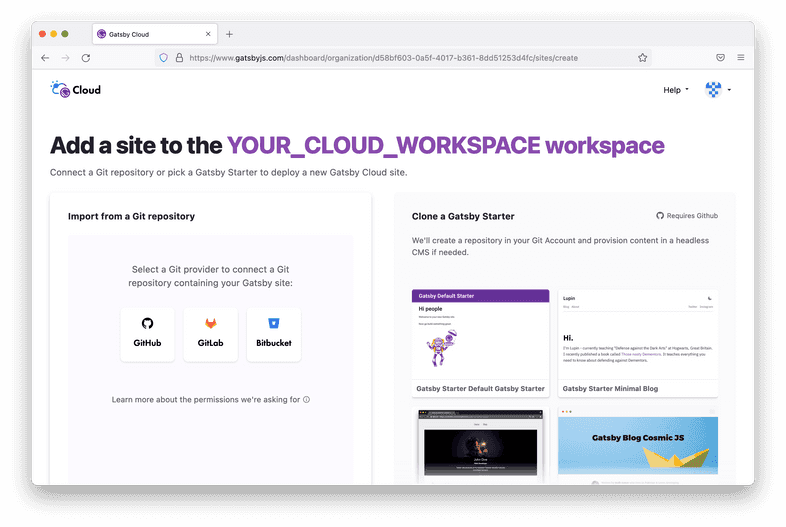
_Image by Gatsbyjs, from https://www.gatsbyjs.com/docs/tutorial/part-1/, licensed under [MIT](https://opensource.org/licenses/MIT)._

<br>

3. GitHub을 Gatsby Cloud에 처음 연결하는 거면, GitHub 계정에 접근할 권한을 Gatsby Cloud에 부여해야 합니다.

   > \*_Note:_ 둘 이상의 GitHub 조직에 속해 있다면, 저장소 자체를 선택하기 전에 먼저 이 단계에서 저장소가 상주하는 조직을 선택해야 합니다.

<br>

4. 새 브라우저 창이 열려, GitHub 저장소에 대한 권한을 Gatsby Cloud에 부여할 것인지를 GitHub이 물을 것입니다. Gatsby Cloud가 모든 GitHub 저장소에 접근하게 할 것인지, 생성했던 저장소(`my-first-gatsby0site`)에만 접근 권한을 부여할 것인지 선택할 수 있습니다. 다음으로 **"Install"**을 클릭합니다.

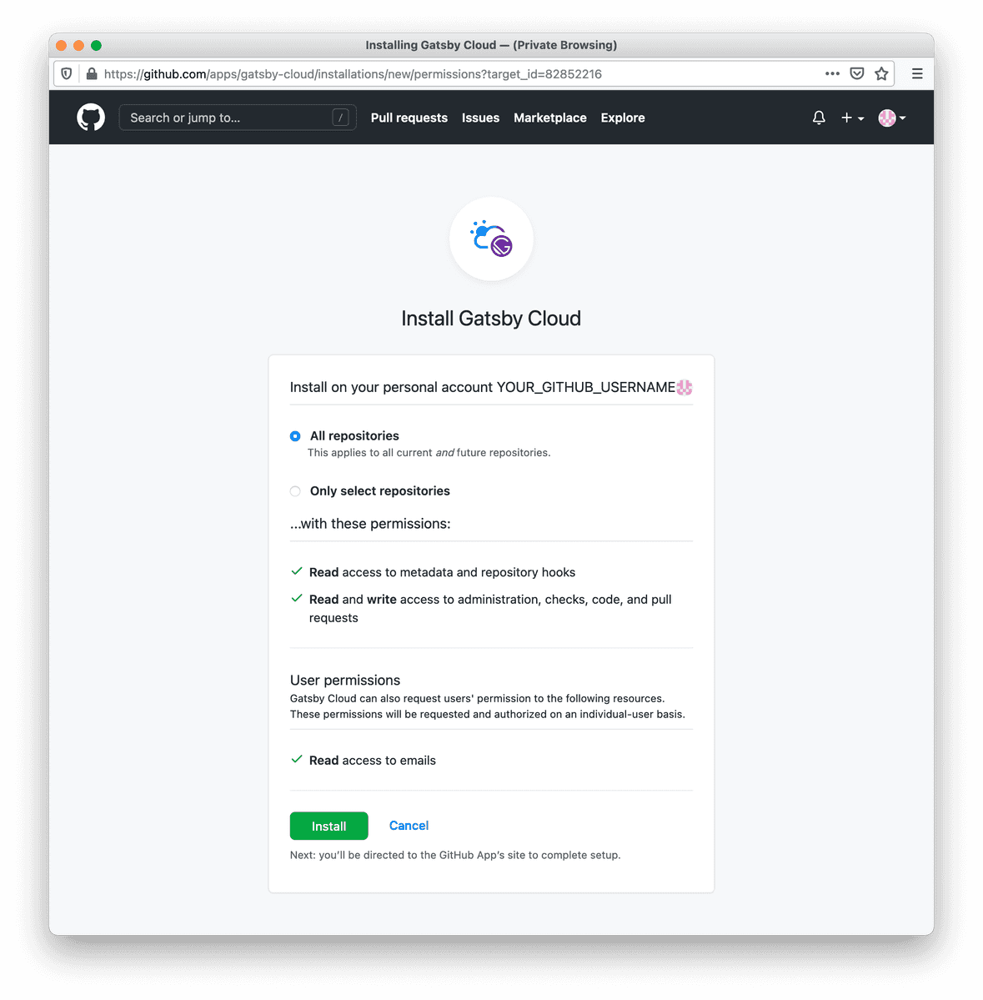
_Image by Gatsbyjs, from https://www.gatsbyjs.com/docs/tutorial/part-1/, licensed under [MIT](https://opensource.org/licenses/MIT)._

<br>

5. 이제 Gatsby Cloud 창으로 돌아가면 저장소 목록에 여러분의 GitHub 저장소가 포함되어야 합니다. **"Import"**를 클릭하여 해당 저장소를 선택하십시오.

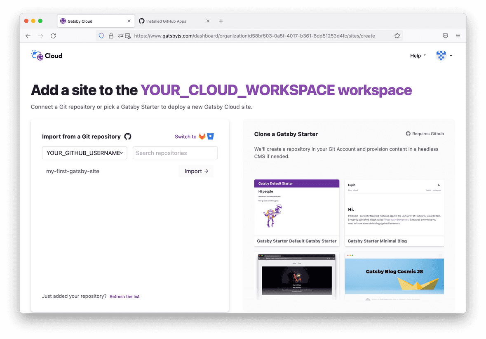
_Image by Gatsbyjs, from https://www.gatsbyjs.com/docs/tutorial/part-1/, licensed under [MIT](https://opensource.org/licenses/MIT)_

<br>

6. 저장소를 선택한 후에는 구성 단계로 이동하게 됩니다. 이를 통해 Gatsby 사이트용 GitHub 저장소에서 탐색해야할 위치를 Gatsby Cloud에 알려줄 수 있습니다. Gatsby Cloud에서 지정하게 될 사이트 이름을 변경할 수도 있습니다. **기본 설정을 그대로 두고**, **"Next"** 버튼을 클릭합니다.

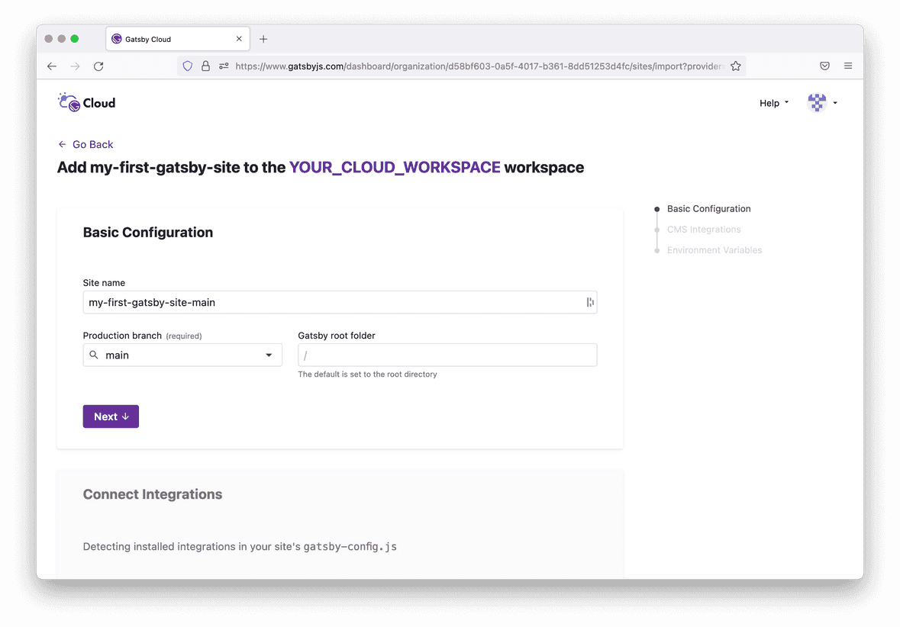
_Image by Gatsbyjs, from https://www.gatsbyjs.com/docs/tutorial/part-1/, licensed under [MIT](https://opensource.org/licenses/MIT)_

<br>

7. Gatsby Cloud는 사이트에 통합헐 것이 있는지를 묻습니다. 향후 프로젝트에서 CMS를 사용하려 한다면 이 기능이 유용할 것입니다. 또한 Gatsby Cloud는 환경 변수를 추가할 것인지 묻습니다. 다시 말하자면 이는 향후 프로젝트에 유용하지만 지금 당장은 아닙니다. 밑으로 스크롤해서 **"Built Site"** 버튼을 클릭합니다.

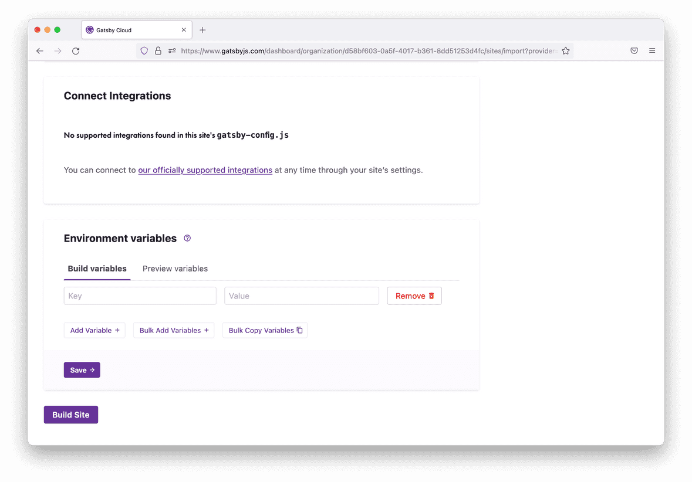
_Image by Gatsbyjs, from https://www.gatsbyjs.com/docs/tutorial/part-1/, licensed under [MIT](https://opensource.org/licenses/MIT)_

<br>

8. 이제 사이트가 생성되었으니 구축 상태를 확인할 수 있는 사이트 대시보드로 이동합니다. Gatsby Cloud는 자동으로 사이트를 구축하기 시작합니다. 여기서 새 사이트의 링크를 확인할 수 있는데, 이는 Gatsby Cloud에서 자동으로 호스팅됩니다. 해당 링크를 누구와도 공유할 수 있으며, 그들은 온라인에서 이 사이트를 볼 수 있습니다!

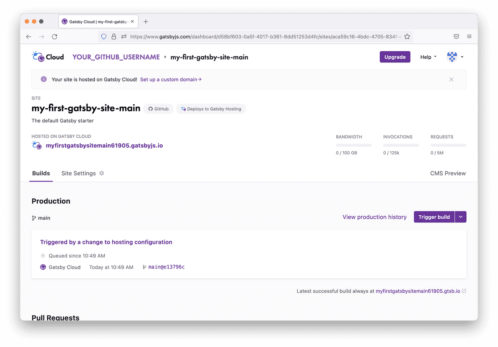
_Image by Gatsbyjs, from https://www.gatsbyjs.com/docs/tutorial/part-1/, licensed under [MIT](https://opensource.org/licenses/MIT)_

<br>

이제 Gatsby 사이트를 온라인에서 확인할 수 있습니다!

새로 변경한 사항을 GitHub 저장소의 main 브랜치에 푸시할 때마다, Gatsby Cloud가 변경 사항을 확인하여 사이트의 새 버전을 자동으로 구축하기 시작합니다.

> **Tip:** 각 구축 시기마다 `https://build-49535320-b3ae-4761-bbeb-f8f7fa07e0fc.gtsb.io/`와 같은 고유한 URL이 제공됩니다. 또한 `my-first-gatsby-site-main.gatsbyjs.io`처럼 항상 최신 구축이 적용된 URL도 있습니다. 방문하는 사람들이 항상 최신 버전 사이트를 볼 수 있도록, 사람이 읽을 수 있는 URL을 공유하기를 대부분 원할 것입니다. 하지만 어떤 경우에는 (사이트의 특정 구축 단계를 디버깅을 시도할 때) 구축할 때마다 제공된 고유한 URL이 유용할 수도 있습니다.

<br>

## 요약

이번 섹션에서는 새 Gatsby 사이트를 생성하고, Gatsby Cloud를 사용하여 온라인에 배포하는 방법을 배웠습니다. 과정을 요약한 다이어그램을 통해 빠르게 복습해 봅시다.


_Image by Gatsbyjs, from https://www.gatsbyjs.com/docs/tutorial/part-1/, licensed under [MIT](https://opensource.org/licenses/MIT)_

<details><summary>자세한 설명</summary>
<p>

먼저, 컴퓨터에서 Gatsby 사이트를 구성하는 코드를 작성합니다. 변경 사항을 인터넷 상에 적용할 준비가 되면 다음 단계를 거칩니다.

1. 컴퓨터에서 변경한 사항을 GitHub 원격 저장소로 푸시합니다. GitHub은 프로젝트의 코드를 저장하는 온라인 플랫폼입니다.
2. Gatsby Cloud는 GitHub 저장소의 변경 사항을 확인합니다. Gatsby Cloud가 새로운 변화를 감지하면 GitHub의 코드로부터 사이트를 구축합니다.
3. Gatsby Cloud는 사이트의 완성 버전을 고유한 URL에서 호스팅하며, 사용자는 이를 통해 사이트의 최신 버전에 접근할 수 있습니다.

</p>
</details>

### 핵심 내용

- 커맨드 라인에서 새 Gatsby 사이트를 생성하려면, `gatsby new` 명령을 실행합니다.
- 사이트를 로컬에서 실행하려면, `gatsby develop` 명령을 사용합니다. `localhost:8000`에서 구동하는 웹 브라우저에서 여러분의 사이트를 볼 수 있습니다.
- Gatsby Cloud는 Gatsby 사이트 구축, 배포, 호스팅에 특별히 최적화된 인프라 플랫폼입니다.
  - 새로운 커밋을 GitHub 저장소의 `main` 브랜치에 푸시하면, Gatsby Cloud는 변경 사항을 감지하여 사이트를 새 버전으로 다시 구축한 후 이를 재배포합니다.

### 다음에 배울 내용
