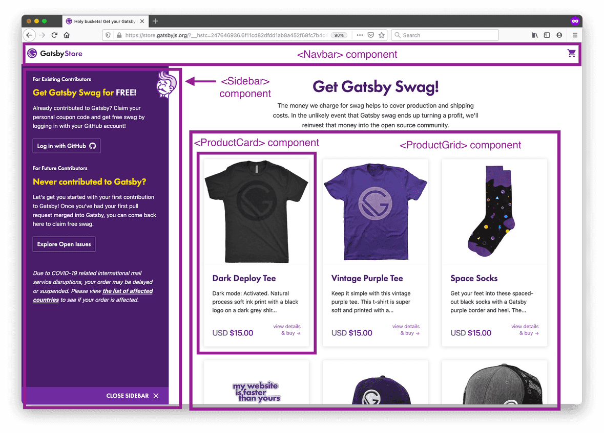
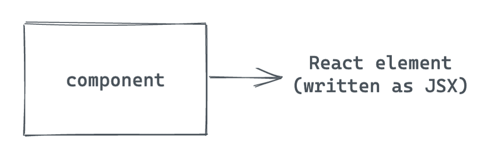
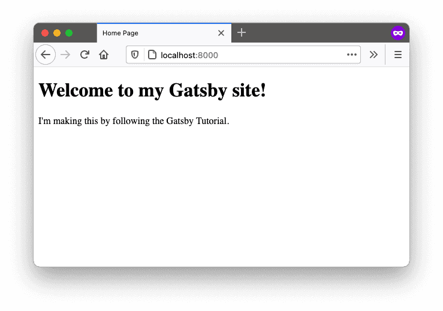
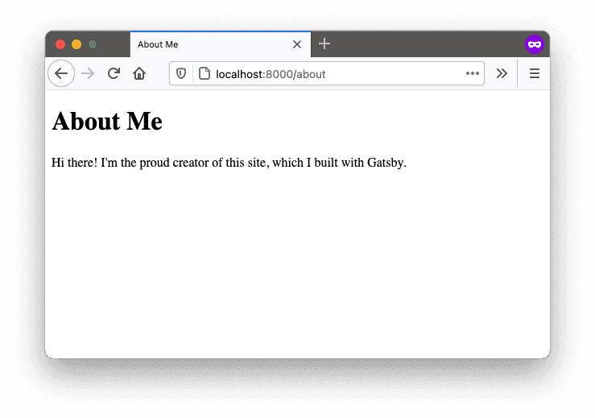
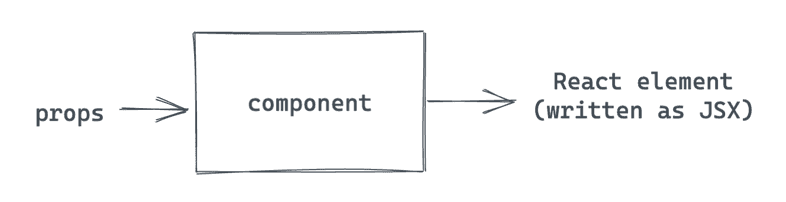
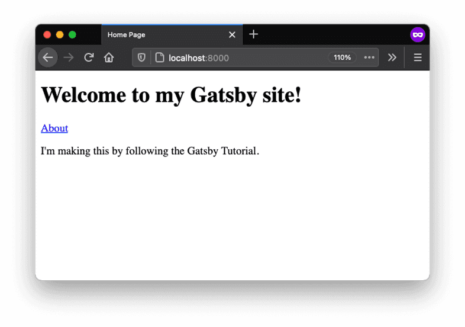
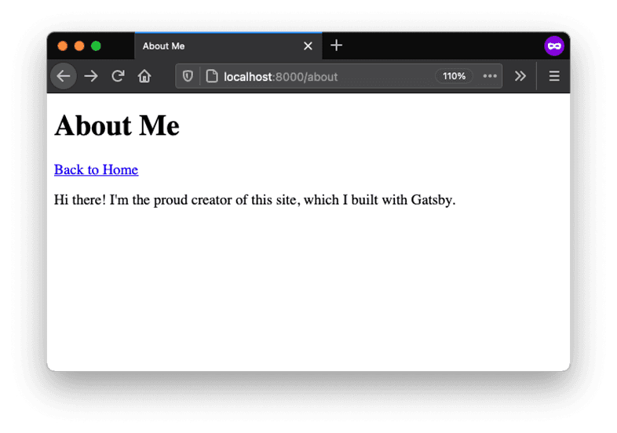
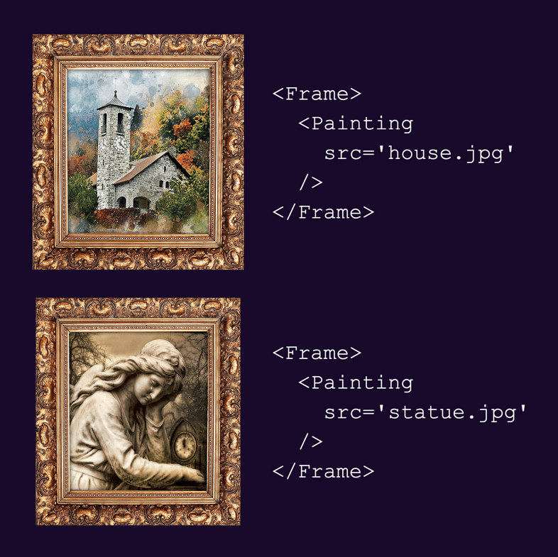
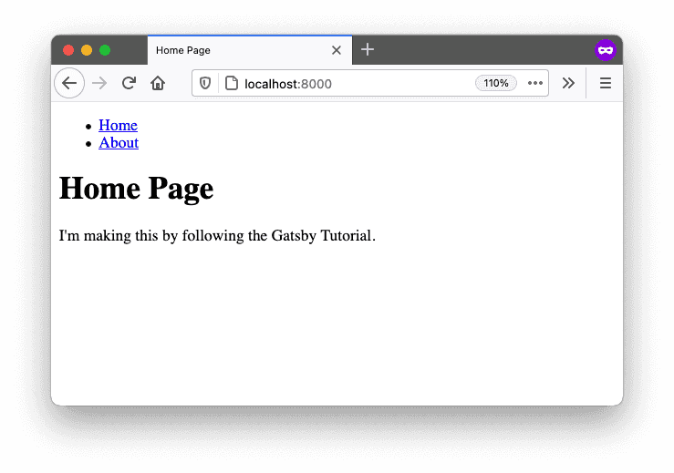
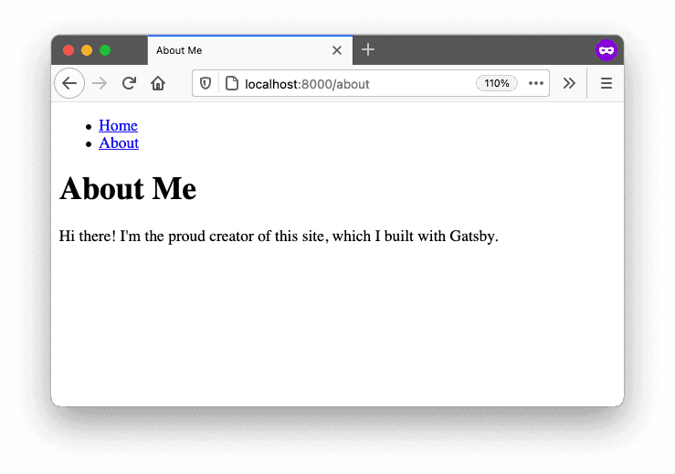

# Part 2: 리액트 컴포넌트 사용 및 스타일 지정

> 이 글은 **Gatsbyjs**의 "[Part 2: Use and Style React Components](https://www.gatsbyjs.com/docs/tutorial/part-2/)"를 번역한 후 수정한 것입니다. 원본 문서는 [MIT 라이선스](https://opensource.org/licenses/MIT)에 따라 사용할 수 있습니다.

<br>

<details><summary>목차</summary>
<p>

[소개](#소개)

[React에 대한 빠른 소개](#react에-대한-빠른-소개)

- [React란?](#react란)
- [React 컴포넌트란?](#react-컴포넌트란)

[페이지 컴포넌트 생성](#페이지-컴포넌트-생성)

- [작업: 홈페이지 콘텐츠 업데이트](#작업-홈페이지-콘텐츠-업데이트)
- [작업: About 페이지에 새로운 페이지 컴포넌트 생성](#작업-about-페이지에-새로운-페이지-컴포넌트-생성)

[\<Linkg\> 컴포넌트 사용](#link-컴포넌트-사용)

[재사용 가능한 레이아웃 컴포넌트 생성](#재사용-가능한-레이아웃-컴포넌트-생성)

[CSS 모듈로 컴포넌트 스타일링](#css-모듈로-컴포넌트-스타일링)

[요약](#요약)

- [핵심 내용](#핵심-내용)
- [다음에 배울 내용](#다음에-배울-내용)

</p>
</details>

<br>

## 소개

이전 장에서는 Gatsby 사이트를 처음으로 시작, Gatsby Cloud를 사용하여 이를 인터넷에 배포했었습니다. 모든 것이 준비되었으니, 이제 본인만의 사이트를 만들 시간입니다.

블로그 사이트의 기본적인 페이지 구조를 확장하려면 React 컴포넌트에 대해서도, Gatsby가 React 컴포넌트를 어떻게 사용하는지도 알아야 합니다.

이번 장을 마칠 때면 다음 작업을 할 수 있습니다.

- **페이지 컴포넌트** 생성하여 사이트에 새 페이지 추가
- **Gatsby Head API** 사용하여 사이트에 제목 추가
- 다른 패키지에서 **이미 빌드된 컴포넌트** 가져와 사용
- **재사용 가능한 "Building Block" 컴포넌트** 직접 생성
- 컴포넌트 **속성** 사용하여 컴포넌트가 렌더링되는 방식 변경
- `childretn` 속성 사용하여 래퍼 컴포넌트 생성

<br>

## React에 대한 빠른 소개

### React란?

React는 Gatsby가 사용자 인터페이스(UI)를 생성하기 위해 내부적으로 사용하는 JavaScript 라이브러리입니다. React를 사용하여 UI를 더 작은 단위, 즉 **컴포넌트**라는 재사용 가능한 조각으로 나눌 수 있습니다.

<br>

예를 들어 온라인 상점의 제품 페이지의 UI를 상상해 보십시오.


_Image by Gatsbyjs, from https://www.gatsbyjs.com/docs/tutorial/part-2/, licensed under [MIT](https://opensource.org/licenses/MIT)._

React에서 해당 페이지를 빌드하려면 탐색 메뉴를 구성하는 `<Navbar>` 컴포넌트, 메인 콘텐츠 옆에 진열되는 추가 정보를 위한 `<Sidebar>` 컴포넌트, 판매 중인 모든 컴포넌트를 진열하는 `<ProductGrid>` 컴포넌트를 사용해야할 것입니다.

<br>

컴포넌트를 다른 컴포넌트로부터 생성할 수도 있습니다. 예를 들어, `<ProductGrid>` 컴포넌트를 `<ProductCard>` 컴포넌트 여러 개가 나열된 목록으로 나눌 수 있습니다. 여기서 각각은 단일 제품에 대한 상세 설명을 보여줍니다. 큰 `<ProductGrid>` 컴포넌트는 더 작은 단위의 `<ProductCard>` 컴포넌트로 _구성되기_ 때문에, 이러한 패턴을 **구성**이라 합니다.

> **시도해 보십시오!**
>
> [블로그 사이트가 완성된 예시](https://gatsbytutorialexample.gatsbyjs.io/)를 다시 살펴보십시오. 페이지를 컴포넌트로 어떻게 나눌 수 있습니까?
>
> 한 페이지 내에서, 또는 여러 페이지에 걸쳐서 반복되는 UI 부분을 찾아보십시오.

<br>

### React 컴포넌트란?

내부 구조에서, **React 컴포넌트**는 React 엘리먼트를 반환하는 함수입니다. **React 엘리먼트**는 React가 DOM 엘리먼트를 렌더링하기 위해 사용하는 객체입니다.


_Image by Gatsbyjs, from https://www.gatsbyjs.com/docs/tutorial/part-2/, licensed under [MIT](https://opensource.org/licenses/MIT)._

<br>

React 엘리먼트를 작성하는 가장 간단한 방법은 **JSX**를 사용하는 것입니다. JSX는 컴포넌트의 DOM 구조를 설명하는 JavScript 확장 구문입니다. JSX를 사용하면 JavaScript 파일에 HTML이 있는 것처럼 보입니다.

```js
const hello = <h1>Hello world!</h1>;
```

<br>

따라서 간단한 React 컴포넌트는 아래와 유사하게 보일 것입니다.

```js
const Greeting = () => {
  return <h1>Hello world!</h1>;
};
```

다음 섹션에서는 React 컴포넌트를 생성하는 법을 알려드리겠습니다.

<br>

## 페이지 컴포넌트 생성

Gatsby 사이트에는 주요한 컴포넌트 타입이 두 가지 있습니다. 첫 번째 생성할 타입은 **페이지 컴포넌트**입니다. 페이지 컴포넌트는 사이트 내 특정 페이지의 UI 엘리먼트를 모두 포함합니다.

이번 섹션에서는 새 페이지 컴포넌트 2개를 생성합니다. 하나는 Home 페이지, 다른 하나는 About 페이지입니다.

<br>

(React 컴포넌트 작성이 처음이시면, 아래 단락을 펼쳐서 빠른 개요를 확인하십시오.)

<details><summary>React 핵심 개념: React 컴포넌트 작성</summary>
<p>

React 컴포넌트 작성할 때는 세 가지 주요 단계를 거칩니다.

1. **`import`문**을 사용하여 `react` 패키지에서 **React**를 가져옵니다. 그러면 `.js` 파일 내에서 JSX를 사용할 수 있습니다.
2. **컴포넌트를 정의합니다.** 이는 JSX 엘리먼트를 반환하는 함수여야할 것입니다.
3. **`export`문을 사용하여 컴포넌트를 내보냅니다.**

<br>

다음은 기본 구조가 코드로 어떻게 적용되는 지에 대한 예시입니다.

```JS
// Step 1: Import React. This lets you use JSX inside your .js file.
import * as React from 'react'

/* Step 2: Define your component. Note that your
component name should start with a capital letter. */
const MyComponent = () => {
  return (
    <h1>Hi, welcome to my site!</h1>
  )
}

/* Step 3: Export your component so it
can be used by other parts of your app. */
export default MyComponent
```

<br>

컴포넌트는 반드시 React 엘리먼트 한 개를 반환해야 하지만, 상위 레벨 엘리먼트 안에 엘리먼트를 원하는 만큼 많이 놓을 수 있습니다. 아래의 코드 스니펫은 유효한 컴포넌트와 유효하지 않은 컴포넌트 예시를 보여줍니다.

```js
import * as React from 'react'

const ValidComponent = () => {
  return (
    <div>
      <h1>A valid component!</h1>
      <p>This will work fine.</p>
      <p>
        Since there is only one top-level element: the div.
      </p>
    </div>
  )
}

const InvalidComponent = () => {
  return (
    <h1>This won't work.</h1>
    <p>Because there are two elements at the top level.</p>
  )
}
```

> 위의 코드로 사이트를 빌드하려 한다면, 다음과 같이 `<InvalidComponent>` 관련 에러가 발생할 것입니다.

```shell
Parsing error: Adjacent JSX elements must be
wrapped in an enclosing tag. Did you want a JSX fragment
<>...</>?
```

</p>
</details>

<br>

### 작업: 홈페이지 콘텐츠 업데이트

React를 전반적으로 파악했으니, 이제 React 컴포넌트를 직접 작성할 시간입니다. 시작하려면 홈페이지의 콘텐츠를 업데이트해야 합니다.

> Visual Studio Code에서 Gatsby 사이트를 열고 커맨드 라인에서 로컬 개발 서버를 시작합니다.
>
> 1.  커맨드 라인 애플리케이션을 여십시오.
> 2.  Gatsby site 폴더로 디렉토리를 변경하십시오.
> 3.  `gatsby develop`을 실행하십시오.
> 4.  웹 브라우저에서 `localhost:8000`을 여십시오.

<br>

1. `src/pages/index.js` 파일을 열어, 콘텐츠를 다음으로 교체합니다. (컴포넌트의 구조가 React 컴포넌트 작성을 위한 세 단계와 어떻게 일치하는지 아시겠습니까?)

```js
// Step 1: Import React
import * as React from "react";

// Step 2: Define your component
const IndexPage = () => {
  return (
    <main>
      <h1>Welcome to my Gatsby site!</h1>
      <p>I'm making this by following the Gatsby Tutorial.</p>
    </main>
  );
};

// You'll learn about this in the next task, just copy it for now
export const Head = () => <title>Home Page</title>;

// Step 3: Export your component
export default IndexPage;
```

<br>

2. 웹 브라우저에서 `localhost:8000`으로 이동합니다. (개발 서버가 다시 빌드할 동안 잠시 기다려야할 수도 있습니다.) 페이지가 업데이트되면 다음과 같이 보일 것입니다.


_Image by Gatsbyjs, from https://www.gatsbyjs.com/docs/tutorial/part-2/, licensed under [MIT](https://opensource.org/licenses/MIT)._

<br>

> **Gatsby 핵심 개념** 💡
>
> Gatsby는 `src/pages`에 있는 파일에서 `default export`로 내보낸 React 컴포넌트에 대한 페이지를 자동으로 생성합니다.
>
> 사용자가 실제로 존재하지 않는 페이지의 URL을 방문하면, Gatsby는 `src/pages/404.js` 페이지 컴포넌트를 사용하여 에러를 표시합니다. 한 번 접근해 보십시오! (`localhost:8000`에서 시도하려면 development 404 페이지에서 "Preview custom 404 page" 버튼을 클릭합니다.)

### 작업: About 페이지에 새로운 페이지 컴포넌트 생성

기존의 Home 페이지를 업데이트했으니, 이제 새로운 페이지를 완전히 처음부터 생성할 시간입니다. About 페이지를 만들어, 자신에 대한 약간의 정보를 사람들에게 알릴 수 있습니다.

1. 새 파일 `src/pages/about.js`을 생성합니다. 아래 코드를 About 페이지의 출발점으로 사용합니다.

```js
// Step 1: Import React
import * as React from "react";

// Step 2: Define your component
const AboutPage = () => {
  return (
    <main>
      <h1>About Me</h1>
      <p>
        Hi there! I'm the proud creator of this site, which I built with Gatsby.
      </p>
    </main>
  );
};

// Step 3: Export your component
export default AboutPage;
```

<br>

2. 페이지에 제목을 추가합니다. [Gatsby Head API](https://www.gatsbyjs.com/docs/reference/built-in-components/gatsby-head/)로 `<title>` 외 다른 [document metadata](https://developer.mozilla.org/en-US/docs/Web/HTML/Element/head)를 정의할 수 있습니다. 메타데이터를 적용하기 위해 페이지 템플릿에서 `Head`라는 컴포넌트를 `export`문으로 내보내야 합니다. 이러한 메타 데이터를 추가함으로써 Google 같은 검색 엔진이 여러분의 사이트를 더 잘 이해할 수 있습니다. 이 튜토리얼에서는 페이지에 제목만 추가하겠지만, 이후에 다른 메타데이터 또한 추가할 수 있습니다.

```js
import * as React from "react";

const AboutPage = () => {
  return (
    <main>
      <h1>About Me</h1>
      <p>
        Hi there! I'm the proud creator of this site, which I built with Gatsby.
      </p>
    </main>
  );
};

export const Head = () => <title>About Me</title>;

export default AboutPage;
```

<br>

> **Gatsby 핵심 개념** 💡
>
> [Gatsby Head API](https://www.gatsbyjs.com/docs/reference/built-in-components/gatsby-head/)은 페이지와 페이지 템플릿에서 `Head`라는 기명함수를 `export`문으로 내보내어서 사용할 수 있습니다. (예: `createPage` 또는 File System Route API에서 사용하는 함수)
>
> `Head`의 첫 글자를 반드시 대문자로 씁니다. 또한 `Layout`같은 컴포넌트에서는 이 기명함수를 내보내어도 `<head>`에 메타데이터를 추가하지 않는다는 점을 기억하십시오. 위의 작업은 `src/pages`의 페이지에서 `Head`를 내보냈기 때문에 가능한 것입니다.
>
> 다음과 같이 `Head` 함수 안에 유효한 `<head>` 태그를 추가할 수 있습니다. 그러면 페이지에 이 태그들이 추가됩니다.

```js
export const Head = () => (
  <>
    <title>About Me</title>
    <meta name='description' content='Your description' />
  </>
);
```

> 이 튜토리얼을 거친 후, [Adding an SEO Component](https://www.gatsbyjs.com/docs/how-to/adding-common-features/adding-seo-component/) 문서를 반드시 확인하십시오.

<br>

3. 웹 브라우저에서 `localhost:8000/about`을 방문합니다. 개발 서버가 사이트를 다시 빌드하는 작업을 마치면, About 페이지는 다음과 같이 보여야 합니다.


_Image by Gatsbyjs, from https://www.gatsbyjs.com/docs/tutorial/part-2/, licensed under [MIT](https://opensource.org/licenses/MIT)._

<br>

> **Gatsby 핵심 개념** 💡
>
> `src/pages` 디렉토리에 생성된 페이지는 파일명을 페이지의 라우트로 사용합니다.
>
> 예를 들어 `src/pages/garden-gnomes.js`라는 파일이 있다면, `localhost:8000/garden-gnomes`에서 해당 페이지를 확인할 수 있습니다.

<br>

## \<Link\> 컴포넌트 사용

페이지 컴포넌트를 몇 개 빌드했으니, 이제 Gatsby 사이트에서 다른 타입의 React 컴포넌트인 \*_building-block_ 컴포넌트를 살펴볼 차례입니다.

> **Note:** building-block 컴포넌트라는 용어는 공식적인 기술 용어는 아닙니다. 이러한 종류의 컴포넌트를 설명하기 위해 생각해낼 수 있는 가장 좋은 이름입니다.

>

Building-block 컴포넌트는 (전체 페이지 대신) 페이지의 사용자 인터페이스 일부만을 나타내는 더 작은 단위의 컴포넌트입니다. ["What is React?"](https://www.gatsbyjs.com/docs/tutorial/part-2/#what-is-react) 섹션에서 소개한 상점 웹사이트 예시를 다시 떠올려 보십시오. `Navbar`, `Sidebar`, `ProductGrid`, `ProductCard` 컴포넌트가 바로 building-block 컴포넌트의 예시입니다. 작은 단위의 building-block 컴포넌트 여러 개를 결합하여 더 큰 단위의 페이지 컴포넌트를 만들 수 있습니다.


_Image by Gatsbyjs, from https://www.gatsbyjs.com/docs/tutorial/part-2/, licensed under [MIT](https://opensource.org/licenses/MIT)._

<br>

building-block 컴포넌트의 강력한 특징 중 하나는 사이트 내 여러 장소에서 동일한 컴포넌트를 재사용할 수 있다는 점입니다. 이는 비슷한 구조를 공유하나 다른 값을 렌더링하여 UI를 구성하는 요소에 특히 유용합니다.

위 이미지를 예로 들면, product grid 내 `ProductCard` 컴포넌트 각각은 제품 사진, 제품명, 짧은 설명, 가격, 제품 페이지 링크를 보여줍니다. 정확한 가격은 제품마다 다르지만, 전반적인 구조는 그대로입니다. `ProductCard` 컴포넌트를 동적으로 생성하여, 그리드 내 모든 제품에 동일한 코드를 재사용할 수 있습니다!

React의 기본 제공 기능인 **속성**을 사용하여 컴포넌트를 동적으로 생성할 수 있습니다.

<details><summary>React 핵심 개념: 속성을 가진 컴포넌트</summary>
<p>

컴포넌트의 속성을 사용하여 컴포넌트가 렌더링되는 방식을 바꿀 수 있습니다. 속성은 기본적으로, 컴포넌트 함수에 전달하는 인자입니다.


_Image by Gatsbyjs, from https://www.gatsbyjs.com/docs/tutorial/part-2/, licensed under [MIT](https://opensource.org/licenses/MIT)._

<br>

아래 코드 스니펫은 컴포넌트가 렌더링될 때 속성을 컴포넌트에 전달하는 방법과, 컴포넌트 정의 시 속성값을 사용하는 방법의 예시를 보여줍니다.

- 컴포넌트를 정의할 때, `props`라는 객체 하나를 인자로 받아야 합니다. `props` 객체는 컴포넌트를 렌더링할 때 전달한 어떤 속성이든 가질 수 있습니다.

```js
// Defining the <Greeting> component
const Greeting = (props) => {
  return <p>Hi {props.name}!</p>;
};

export default Greeting;
```

> **구문 힌트:** Javascript 표현식을 `{}`으로 래핑해서 JSX에 삽입합니다. 이렇게 해서 `props` 객체의 `name` 속성에 접근할 수 있습니다.

<br>

- `Greeting` 컴포넌트를 렌더링할 때, `name`속성에 `"Megan"`과 같은 특정 값을 전달합니다. `Greeting` 컴포넌트를 렌더링할 때마다 다른 스트링으로 교체할 수 있습니다.

```js
import Greeting from "../components/greeting";

// Rendering the <Greeting> component
const SayHello = () => {
  return (
    <div>
      <Greeting name='Megan' />
      <Greeting name='Obinna' />
      <Greeting name='Generosa' />
    </div>
  );
};
```

속성의 이름을 원하는대로 지을 수 있습니다. 예를 들어 컴포넌트 렌더링 시 `iceCreamFlavor="mint chip"`을 전달한다면, 컴포넌트 내부에서 `props.iceCreaFlavor`을 언급하여 해당 속성을 사용할 수 있습니다.

</p>
</details>

<br>

현재 여러분의 블로그 사이트에는 개별 페이지 두 개(Home, About)가 있습니다. 그런데, 한 페이지에서 다른 곳으로 이동하려면 URL을 수동으로 업데이트해야하는 문제가 있습니다. 페이지 사이를 더 수월하게 넘나들 수 있도록 링크를 추가하는 것이 좋겠습니다.

`Link` 컴포넌트는 **이미 빌드되어** 여러분의 사이트에서 사용할 수 있는 컴포넌트의 한 예입니다. 즉, `Link`는 별도의 패키지(Gatsby 패키지)에서 정의하고 관리하는 컴포넌트입니다. 따라서 `Link`는 내부를 자세히 알 필요 없이 다른 컴포넌트에 `import`해서 사용할 수 있습니다.

`Link` 컴포넌트로 Gatsby 사이트 내 다른 페이지 링크를 추가할 수 있습니다. 이는 HTML의 `<a>` 태그와 유사하지만, 성능 면에서 이점이 추가됩니다. `Link` 컴포넌트는 `to`라는 속성을 갖는데, 이는 `<a>` 태그의 `href` 특성(attribute)과 비슷합니다. 해당 값은 사이트 내에서 연결하고자 하는 페이지의 URL 경로여야할 것입니다.

> **Gatsby 핵심 개념 💡**
>
> Gatsby의 `Link` 컴포넌트는 **preloading**이라는 퍼포먼스를 제공합니다. 이는 곧 링크가 스크롤되어 시야에 들어오거나 링크 위에 마우스 커서를 올릴 때, 링크된 페이지의 리소스를 요청한다는 의미입니다. 이런 방식으로 사용자가 실제로 링크를 클릭할 때 새 페이지가 훨씬 더 빠르게 로딩됩니다.
>
> 사이트 내 페이지 사이를 연결하는 `Link` 컴포넌트를 사용하십시오. 여러분의 Gatsby 사이트에서 만들지 않았던 외부 페이지 링크에는 HTML `<a>` 태그를 사용하십시오.

<br>

다음 다계를 따라 `Link` 컴포넌트를 Home, About 페이지에 추가합니다.

1. Home 페이지에 Gatsby 패키지의 `Link` 컴포넌트를 `import`해서 About 페이지 링크를 추가합니다.

```js
import * as React from "react";
import {Link} from "gatsby";

const IndexPage = () => {
  return (
    <main>
      <h1>Welcome to my Gatsby site!</h1>
      <Link to='/about'>About</Link>
      <p>I'm making this by following the Gatsby Tutorial.</p>
    </main>
  );
};

export const Head = () => <title>Home Page</title>;

export default IndexPage;
```

<br>

2. About 페이지에 Gatsby 패키지의 `Link` 컴포넌트를 `import`해서 Home 페이지 링크를 추가합니다.

```js
import * as React from "react";
import {Link} from "gatsby";

const AboutPage = () => {
  return (
    <main>
      <h1>About Me</h1>
      <Link to='/'>Back to Home</Link>
      <p>
        Hi there! I'm the proud creator of this site, which I built with Gatsby.
      </p>
    </main>
  );
};

export const Head = () => <title>About Me</title>;

export default AboutPage;
```

<br>

3. 웹 브라우저에서 각 링크를 클릭해 제대로 작동하는지 확인합니다.





_Images by Gatsbyjs, from https://www.gatsbyjs.com/docs/tutorial/part-2/, licensed under [MIT](https://opensource.org/licenses/MIT)._

<br>

## 재사용 가능한 레이아웃 컴포넌트 생성

완성된 블로그의 예시를 살펴 보면, 사이트 제목이나 탐색 메뉴처럼 여러 페이지에서 반복되는 UI 일부를 확인할 수 있습니다.

해당 요소를 각 페이지에 개별적으로 복사할 수 있습니다. 그런데 여러분의 사이트에 수십 개 또는 수천 개 페이지가 있다면 어떨까요? 탐색 메뉴의 구조에 변화를 주고 싶을 때면 모든 파일을 개별적으로 업데이트해야할 것입니다.

이 대신, 공통된 요소를 여러 페이지에서 재사용하도록 그룹화하는 `Layout` 컴포넌트를 하나 생성하는 것이 좋습니다. 레이아웃을 업데이트해야할 때, `Layout` 컴포넌트만 변경하면 해당 컴포넌트를 사용하는 모든 페이지가 자동으로 변경됩니다.

이번 섹션에서는 **사용자 지정** building-block 컴포넌트인 `Layout`을 생성해 보겠습니다. `Layout`을 생성하려면 `children`이라는 특별한 React 속성을 사용해야 합니다.

<details><summary>React 핵심 개념: children 속성을 가진 컴포넌트</summary>
<p>

React는 컴포넌트에 추가할 수 있는 속성 외에도, 컴포넌트에 대한 특정한 속성 또한 자동으로 생성합니다.

그런 속성 중 하나가 바로 `children`입니다. 컴포넌트의 시작태그와 종료태그 사이에 있는 내용이 `children` 속성이며, 이는 컴포넌트가 렌더링될 때 자동으로 전달됩니다.

<br>

> 이전 섹션의 `Link` 컴포넌트 또한 `children` 속성을 사용했습니다. `children` 속성으로, 하이퍼링크용 텍스트를 전달할 수 있습니다.

```js
<Link to='/'>This text is passed into the Link component's children prop!</Link>
```

<br>

래퍼 컴포넌트를 액자라 생각해 보십시오. 액자마다 각각의 모양과 스타일을 가지지만 내용물은 언제든 교체할 수 있습니다. 집 사진에도, 조각상 사진에도 동일한 액자를 씌울 수 있습니다. 사진 외에도 그림이나 자수 조각을 넣을 수 있습니다.

<br>


_Image by Gatsbyjs, from https://www.gatsbyjs.com/docs/tutorial/part-2/, licensed under [MIT](https://opensource.org/licenses/MIT)._

<br>

다음은 이 시나리오대로 코드를 구현한 예시입니다. 먼저 `<Frame>` 컴포넌트가 렌더링되면 시작태그와 종료태그 사이 내용물을 가져갑니다.

```js
// src/pages/gallery.js의 코드입니다.
import React from "react";
import Frame from "../components/frame";

const GalleryPage = () => {
  return (
    <Frame>
      <p>This will be passed in as children</p>
    </Frame>
  );
};

export default GalleryPage;
```

<br>

다음으로, 컴포넌트를 정의하는 부분에 `children` 속성이 전달됩니다. JSX를 사용하여 `children` 속성을 렌더링할 수 있습니다.

```js
// src/components/frame.js의 코드입니다.

import React from "react";

const Frame = ({children}) => {
  return (
    <div>
      <h1>This is the page title</h1>
      {children}
    </div>
  );
};

export default Frame;
```

<br>

브라우저에서 실제로 보이는 DOM 요소는 다음과 같습니다.

```html
<div>
  <h1>This is the page title</h1>
  <p>This will be passed in as children</p>
</div>
```

</p>
</details>

<br>

아래 단계를 따라 `Layout` 컴포넌트를 생성하여 이를 Home, About 페이지에 추가합니다.

1. 새 파일 `src/components/layout.js`를 생성합니다. 다음 코드를 삽입해서 `Layout` 컴포넌트를 정의합니다. 이 컴포넌트는 `pageTitle` 속성으로부터 동적 제목을, `children` 속성으로 전달된 탐색 링크 목록과 콘텐츠를 렌더링합니다. 접근성을 향상시키려면 `<main>` 엘리먼트로 페이지별 엘리먼트(`<h1>`, `children`)를 래핑하면 됩니다.

```js
import * as React from "react";
import {Link} from "gatsby";

const Layout = ({pageTitle, children}) => {
  return (
    <div>
      <nav>
        <ul>
          <li>
            <Link to='/'>Home</Link>
          </li>
          <li>
            <Link to='/about'>About</Link>
          </li>
        </ul>
      </nav>
      <main>
        <h1>{pageTitle}</h1>
        {children}
      </main>
    </div>
  );
};

export default Layout;
```

> **구문 힌트:** `Layout` 컴포넌트가 속성을 전달 받을 때 이전과 약간 다른 구문을 사용함을 확인할 수 있습니다.

```js
const Layout = (props) => {
  ...
}
```

> 이런 형식 대신 다음과 같은 구문을 사용합니다.

```js
const Layout = ({ pageTitle, children }) => {
  ...
}
```

> 이는 **구조 분해**라는 JavaScript 기술로, 기본적으로 객체의 속성에 기반해 변수를 정의하기 위한 '바로가기'입니다. 위 구문은, "함수에 전달되는 객체를 받아, 여기의 `pageTitle`과 `children`을 각각의 변수로 분리하라"고 말하는 것과 같습니다.
>
> 즉, 다음의 작업을 더 빠르게 실행하는 지름길입니다.

```js
const Layout = (props) => {
  const pageTitle = props.pageTitle
  const children = props.children
  ...
}
```

<br>

2. 이전 섹션에서 하드 코딩으로 작성하여 추가한 `Link` 컴포넌트 대신, Layout 컴포넌트를 사용하여 Home 페이지 컴포넌트를 업데이트합니다.

```js
// src/pages/index.js의 코드입니다.
import * as React from "react";
import Layout from "../components/layout";

const IndexPage = () => {
  return (
    <Layout pageTitle='Home Page'>
      <p>I'm making this by following the Gatsby Tutorial.</p>
    </Layout>
  );
};

export const Head = () => <title>Home Page</title>;

export default IndexPage;
```

<br>

3. 마찬가지로 Layout 컴포넌트를 사용하여 About 페이지 컴포넌트를 업데이트합니다.

```js
// src/pages/about.js의 코드입니다.
import * as React from "react";
import Layout from "../components/layout";

const AboutPage = () => {
  return (
    <Layout pageTitle='About Me'>
      <p>
        Hi there! I'm the proud creator of this site, which I built with Gatsby.
      </p>
    </Layout>
  );
};

export const Head = () => <title>About Me</title>;

export default AboutPage;
```

<br>

4. 웹 브라우저의 Home, About 페이지에 접속하여 새로운 `Layout` 컴포넌트가 제대로 적용되었는지 확인합니다.





_Images by Gatsbyjs, from https://www.gatsbyjs.com/docs/tutorial/part-2/, licensed under [MIT](https://opensource.org/licenses/MIT)._

<br>

## CSS 모듈로 컴포넌트 스타일링

페이지 구조를 설정했으니, 이제 페이지 스타일을 추가할 차례입니다!

Gatsby에서는 어떤 스타일링 방식을 사용해도 무방합니다. 사용하기 가장 편한 시스템을 선택할 수 있습니다.

이번 튜토리얼에서는 **CSS 모듈**을 사용하여 컴포넌트에 스타일을 지정할 것입니다. 이는 스타일을 컴포넌트에서만 사용할 수 있다는 의미로, 컴포넌트 사이 클래스 이름 충돌을 방지할 수 있습니다. Gatsby는 CSS 모듈을 처리하도록 자동으로 설정되어 있어 추가로 설치하지 않아도 됩니다!

<details><summary>스타일링 핵심 개념: CSS 모듈</summary>
<p>

CSS 모듈을 사용해서 스타일을 정의하려면, 확장자가 `module.css`인 파일에 CSS를 넣습니다. 이를 통해 Gatsby에게 해당 CSS 파일은 단순 CSS가 아닌, CSS 모듈로 처리되어야 함을 알립니다.

CSS 파일에서 스타일을 지정하려는 각 요소마다 개별적으로 CSS 클래스를 생성합니다. 예를 들면 다음과 같습니다.

```js
// src/components/my-component.module.css의 코드입니다.

.title {
  color: blue;
  font-size: 3rem;
}
```

<br>

다음으로 `.js` 컴포넌트 파일에 클래스를 개별적으로 `import`한 후, 상응하는 React 요소에 적용합니다.

```js
// src/components/my-component.js의 코드입니다.
import * as React from "react";
import {title} from "./my-component.module.css";

const MyComponent = () => {
  return <h1 className={title}>Super Sweet Title Page</h1>;
};

export default MyComponent;
```

웹 브라우저에서 개발자 콘솔을 열고 `<h1>` 요소를 검사해 보면, `my-component-module---title---21RF7`같은 긴 클래스 이름이 보일 겁니다. 이는 CSS 모듈이 생성한 클래스 이름입니다.
**(여기부터 수정 필요)** 사이트 전역에 걸쳐 분명 유일하며, `module.css` 파일 내 `.title` 클래스를 가진 또 다른 컴포넌트가 있더라도 마찬가지입니다. 이는 CSS 모듈이 인기 있는 스타일링 기법인 이유 중 하나입니다. CSS 모듈을 통해 컴포넌트 영역에서 사용 가능한 CSS를 작성할 수 있으며, 컴포넌트 사이에 발생하는 셀렉터 이름 충돌에 대해 걱정할 필요가 없습니다.

</p>
</details>

## 요약

복습용 질문

1. 페이지 컴포넌트와 building-block 컴포넌트의 차이점은?

   - 페이지 컴포넌트는 특정 페이지를 구성하는 모든 UI 엘리먼트를 포함하는 컴포넌트이다. 빌딩 블록 컴포넌트는 이 중에서 재사용이 가능한 것을 일컫는다.

2. 개츠비 사이트에 새로운 페이지를 추가하는 법은?

   - `src/pages` 경로에 .js 파일 추가. 파일 내 페이지 컴포넌트 생성 후 export

3. 페이지에 타이틀을 지정하는 법은?

   - 개츠비 Head API를 사용: `export const Head = () => <title>제목</title>`

4. 새 리액트 컴포넌트를 작성하기 위한 세 단계는?

   - 'react' 패키지로부터 리액트 import. .js 파일에서 JSX를 사용할 수 있다.
     &rarr; 컴포넌트 define. 이는 JSX 엘리먼트를 return하는 함수이다.
     &rarr; 컴포넌트 export.

5. props는 무엇이며, 이를 언제 사용하는가?

   - 컴포넌트로 전달하는 인자로, 페이지 렌더링 방식을 변경할 때 사용

6. `children` prop은 무엇이며 왜 유용한가?
   - 컴포넌트를 render할 때 시작 태그와 마침 태그 사이에 있는 컨텐츠면 무엇이든지 자동으로 전달되는데, 이것이 `children` prop이다. 일종의 프레임 역할을 하는 컴포넌트를 공통으로 사용하면서 안의 컨텐츠만 변경하고자 할 때 유용하다.

### 핵심 내용

- React: UI를 component라 불리는 작은 조각으로 분해할 수 있게 도우는 라이브러리

  - Component: React element를 리턴하는 함수
  - React element는 JSX로 작성

- **페이지 컴포넌트**에는 특정 페이지를 구성하는 모든 UI element가 포함된다. 개츠비는 `src/pages` 경로의 파일에서 `default exports`하는 컴포넌트를 가지고 자동으로 페이지를 생성한다. 이 파일명은 페이지의 루트로 쓰인다.

- 페이지의 메타 데이터를 정의하는 기명함수 `Head`를 export해서**Gatsyby Head API** 사용할 수 있다.

**Building-block 컴포넌트**는 UI를 구성하는 컴포넌트 중 재사용 가능한 작은 단위이다. 페이지 컴포넌트 또는 다른 building-block 컴포넌트에서 이를 import할 수 있다.

- `Link`와 같이 다른 패키지로부터 **미리 빌드된 컴포넌트** import할 수 있다. 또는 `Layout`처럼 고유한 **커스텀** 컴포넌트를 만들 수도 있다.

- **props**로 컴포넌트 렌더링 방식을 바꿀 수 있다. 컴포넌트 빌드 시 고유한 props를 정의할 수 있다. 리액트는 `children`, `className`같은 built-in props 또한 가지고 있다.

- 개츠비에서는 기본적으로 **CSS Modules**로 style 작업을 한다.

<br>

### 다음에 배울 내용
